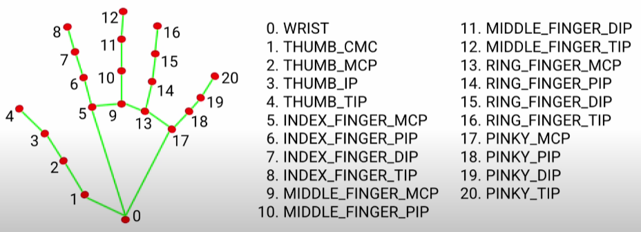
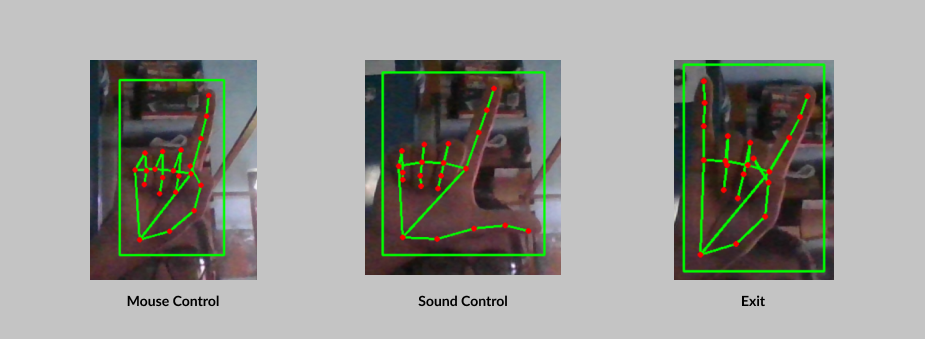

# Gesture Control

An application which uses hand gesture to control the mouse pointer and control the sound of the system. This is achieved by using mediapipe library provided by Google and OpenCV framework.

MediaPipe is a framework for building multimodal (eg. video, audio, any time series data), cross platform (i.e Android, iOS, web, edge devices) applied ML pipelines. With MediaPipe, a perception pipeline can be built as a graph of modular components, including, for instance, inference models (e.g., TensorFlow, TFLite) and media processing functions.

## Hand Landmarks

A hand landmark model that operates on the cropped image region defined by the palm detector and returns high-fidelity 3D hand keypoints. This strategy is similar to that employed in our MediaPipe Face Mesh solution, which uses a face detector together with a face landmark model.

Providing the accurately cropped hand image to the hand landmark model drastically reduces the need for data augmentation (e.g. rotations, translation and scale) and instead allows the network to dedicate most of its capacity towards coordinate prediction accuracy. 

    

<center> </center>

## Gestures

All gestures to be used to control the mouse pointer and to control the sound.

<center> </center>


## Setup

Clone the repository and install other requirements:

```
git clone https://github.com/ayanbag/GestureControl.git
cd GestureControl
pip install -r requirements.txt
```


## Usage
For using the GestureControl application:
```
python gestureControl.py
```